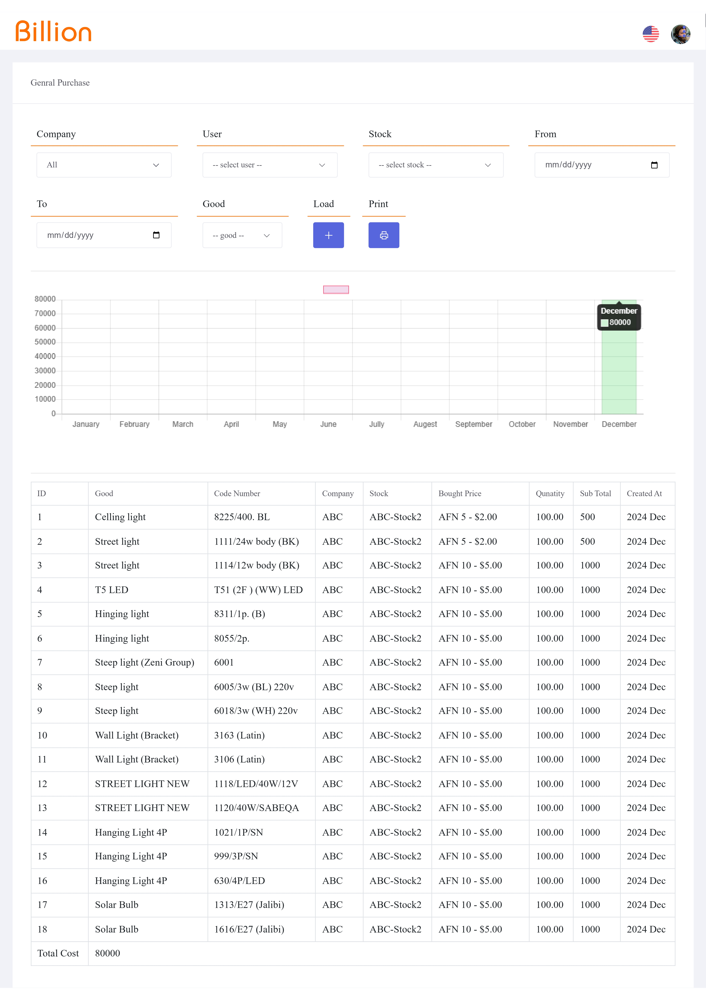

# **Billion Management System**  

## **Overview**  
Billion is designed as a comprehensive management system for businesses, warehouses, supermarkets, retail stores, and more.  

Billion processes all essential financial data from purchase to sale and reporting with speed and precision, simplifying financial and accounting tasks.  

With this system, you can access any company information in seconds, such as:  
- List of purchased items  
- Inventory details  
- Sold items list  
- Customer information  
- Supplier details, and more  

Billion supports multiple companies, warehouses, branches, and users with distinct access levels, enabling accurate and separate financial and administrative management. It automates complex and time-consuming calculations.  

The system generates reports on gross income, net income, company income, personal income, branch income, company expenses, personal expenses, salaries, and many other reports in just a few seconds.  

Billion is available in two languages: Dari,English, and can be used both online (with internet) and offline (without internet).  

## **Dashboard**  
The dashboard serves as the central hub of the system, providing quick access to critical insights.  

### **Key Feature: Sales Chart**  
The dashboard prominently displays a dynamic chart showcasing the sales data for the past week. This chart is specific to the currently logged-in user, allowing personalized and real-time insights into their performance.  

  

---

## **Sections and Features**  

### **1. Purchases**  
Manage purchase activities, supplier details, and stock additions.  

#### **Features:**  
- **Add Purchase:** Create a new purchase record, including items, quantities, and prices.  
- **Edit Purchase:** Modify existing purchase details.  
- **Delete Purchase:** Remove unwanted purchase records.  
- **Print Purchase:** Generate a printable version of purchase details.  
- **Processed Remain Amount:** Record pending amounts for purchases.  
- **Purchase Goods:** View a comprehensive list of all purchased goods.  
- **Supplier Management:**  
  - Add, edit, and list supplier details.  

#### **Screenshots:**  
- Add Purchase:   
- Supplier Management:   
- Process Remain Amount:   
- Purchase Goods:   
---

### **2. Stock**  
Handle inventory effectively with real-time tracking and processing.  

#### **Features:**  
- **Add Stock:** Create, edit, or delete stock entries and assign stock to users.  
- **Add Good:** Manage goods by adding, editing, or deleting records.  
- **Add Good Category:** Categorize goods for better organization.  
- **Available Goods:** List and edit all available goods, process damaged goods, and transfer stock good.  
- **Damage Goods:** Track and return damaged goods to available stock.  
- **Transact Stock:** View a list of all stock transactions.  
- **Good Transactions:** View a detailed log of goods transactions.  

#### **Screenshots:**  
- Add Stock:   
- Assign Stock To Users:   
- Available Goods:   
- Process Damaged Goods From Available:  
- Transfer Stock Good From Available:  
- Damaged Goods:   
- Return to Available from Damage Good:  
- Transact Stock:   
- Good Transactions:   

---

### **3. Sales**  
Manage sales operations, customer records, and indirect income tracking.  

#### **Features:**  
- **Add Sale:** Record new sales transactions.  
- **Edit/Delete Sale:** Modify or remove existing sales records.  
- **Print Sale:** Generate printable sales receipts.  
- **Processed Remain Amount:** Track pending payments for sales.  
- **Sell Goods:** List sold goods and process return goods.  
- **Customer Management:** Add, edit, delete, or list customer records.  
- **Indirect Income:** Track other sources of income by adding, editing, or deleting records.  

#### **Screenshots:**  

- Add Sale:   
- Customer Management:   
- Process Remain Amount:   
- Sale Goods:   
- Indirect Income:   
---

### **4. Expenses**  
Efficiently monitor company expenses and expense types.  

#### **Features:**  
- **Expense:** Add, edit, delete, or list expenses.  
- **Expense Type:** Manage types of expenses for categorization.  

#### **Screenshots:**  
- Expense Management:   
- Expense Type Management:   

---

### **5. Management**  
Administer system settings, companies, users, and roles.  

#### **Features:**  
- **Company Management:** Add, edit, delete, or list companies.  
- **User Management:** Manage system users with permissions.  
- **Role Management:** Define roles with specific access levels.  

#### **Screenshots:**  
- Company Management:   
- User Management:   
- Role Management:   

---

### **6. Reports**  
Generate detailed reports to monitor the company’s performance and finances.  

#### **Categories:**  
- **Income:**  
  - Personal, Company, General, and Other income reports.  
- **Purchases:**  
  - General purchase reports.  
- **Expenses:**  
  - Personal, Company, and General expense reports.  
- **Liabilities:**  
  - Receivable and payable liability reports.  
- **Logs:**  
  - Update logs, sales, and purchase reports.  
- **Balance:**  
  - Overview of costs, profits, and total revenue.  

#### **Screenshots:**  
- Purchase General Report:  
- Income General Report:   
- Income Company Report:   
- Income Personal Report:   
---

#### **Screenshots:**  
- Expenses General Report:   
- Expenses Company Report:   
- Expenses Personal Report:   
---

#### **Screenshots:**  
- Liabilities Report:   
---

#### **Screenshots:**  
- Available Update Log:   
- Sale Purchase Report:   
---

#### **Screenshots:**  
- Balance Overview:   
---

## **Installation**  

1. **System Requirements:**  
   - Operating System: Windows/Linux  
   - Memory: 4 GB RAM minimum  
   - Storage: 20 GB free space  

### **Technologies Used**  
- **Laravel**: PHP framework for the backend  
- **JavaScript**: Client-side interactivity  
- **AJAX**: For asynchronous data processing  
- **Bootstrap**: Frontend framework for UI  
- **MySQL**: Database management system  
---

## **Support**  
For assistance:  
- **Email:** `romalakbari93@gmail.com`  
- **Phone:** `+93789647997`  

---
>>>>>>> d05fd69 (Initial commit)
